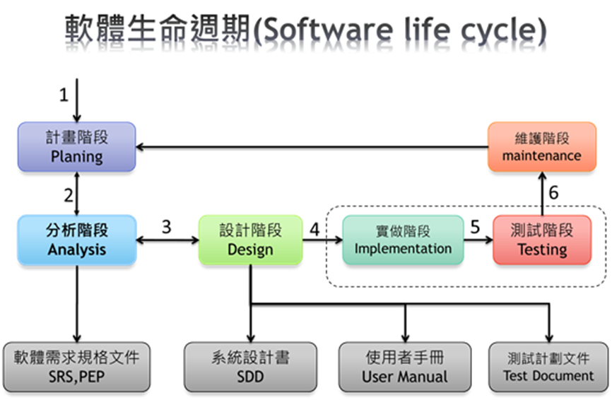

# Software_Engineering_Practice
> 2025 Spring

## 課程計畫
* 課程中會教導的部分: 
    * 計畫階段Planing (PEP) 
    * 分析階段Analysis (SRS)
    * 設計階段Design (SDD)
    * 測試計畫文件 (Test plan)
* 課程中給予學生做專題討論的部
    * 計畫階段Planing (PEP)
    * 分析階段Analysis (SRS)
    * 測試計畫文件 (Test plan)

## 成績計分方式
1. Lab: 20%
2. HW (Homework) : 30%
3. 課後 QA: 15%
4. Guided Note: 10%
5. Term Project: 25%
